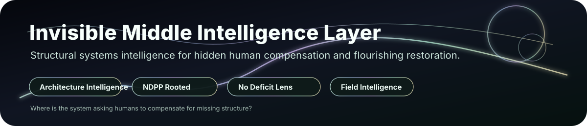

# Invisible Middle Intelligence Layer



**Structural systems intelligence for hidden human compensation, burden transfer, containment instability, and flourishing restoration.**


> Where is the system asking humans to compensate for missing structure?

Some systems do not fail loudly.

They keep moving.

The dashboard stays green.  
The workflow completes.  
The form submits.  
The AI produces output.  
The process appears functional.

But underneath, someone is carrying what the system failed to hold.

Someone is checking again.  
Someone is rebuilding lost context.  
Someone is translating lived reality into rigid fields.  
Someone is holding authority without control.  
Someone is repairing trust after the system quietly destabilised it.  
Someone is absorbing the cognitive, emotional, interpretive, and nervous-system cost of missing structure.

That hidden zone is the **Invisible Middle**.

The Invisible Middle Intelligence Layer exists to make that zone visible without reducing it.

It is built from Carla Bowley’s Invisible Middle lens and NDPP’s neurodivergent-rooted systems thinking: the recognition that some people feel unsmooth systems earlier because unresolved ambiguity, weak closure, lost context, and unclear authority land directly in the human field before formal failure appears.

This is not a deficit lens.

It is architecture intelligence.

Neurodivergent and high-sensitivity interaction patterns can reveal system instability early, not because the person is the problem, but because the system is asking humans to compensate for what the infrastructure has not contained.

## Core Claim

The Invisible Middle Intelligence Layer detects where systems remain outwardly functional while relying on hidden human compensation underneath.

It does not ask only:

> What happened?

It asks:

> What does this pattern suggest about the structural condition of the surrounding system?

The layer applies across education, SEN, organisational design, edtech, CRMs, workforce systems, public services, care environments, and AI-supported workflows.

## Why This Exists

Modern systems often measure visible completion while missing hidden human cost.

They can show:

- task completion
- workflow throughput
- AI output generation
- dashboard activity
- submitted forms
- closed tickets
- apparent engagement

while people are still carrying:

- repeated checking
- unresolved interpretation
- authority without control
- context reconstruction
- trust repair
- monitoring burden
- closure uncertainty
- escalation management
- cognitive strain
- participation fatigue

The issue is not always visible failure.

The issue is often hidden compensation.

## Start Here

- **Non-technical readers:** start with `docs/00_START_HERE.md` and `docs/08_BUYER_GUIDE.md`
- **Practitioners:** review `docs/SIGNAL_TAXONOMY_ARCHITECTURE.md`, `docs/REBALANCE_LOGIC.md`, and `examples/`
- **Technical reviewers:** inspect `docs/ARCHITECTURE.md`, `schemas/`, and `invisible_middle/`

## Operating Pathway

```text
Signal Intake
→ Contextual Interpretation
→ Structural Inference
→ Hidden Compensation Mapping
→ Burden / Flourishing Assessment
→ Response Guidance
→ Evidence Surface
→ Optional Boundary Interface
```

## What This Is Not

The Invisible Middle Intelligence Layer is not:

- generic AI governance
- productivity analytics
- user satisfaction research
- wellbeing branding
- ordinary accessibility compliance
- change management
- UX polish
- behavioural scoring
- employee surveillance
- a protected Elyria / Veritas substrate
- an enforcement kernel

The dashboard is only the visibility surface.

The product is the intelligence architecture beneath it.

## Elyria Systems / VA Boundary

This repository is prepared under Elyria Systems / VA integration framing.

It contains the public Invisible Middle Intelligence Layer only: a diagnostic and structural interpretation layer for identifying hidden human compensation, burden transfer, containment instability, and flourishing degradation in human-facing systems.

It does **not** contain or claim a live protected Elyria / Veritas enforcement substrate.

This repository does not include:

- protected substrate mathematics
- private admissibility machinery
- scoring law
- kernelization logic
- enforcement internals
- customer law bundles
- private deployment adapters

Where Elyria Systems / VA is referenced, it refers to organizational framing, public-safe integration boundaries, evidence-envelope compatibility, and optional future runtime handoff surfaces.

## Core Concepts

### Signal Visibility ≠ Intelligence

Monitoring shows that something happened.

The Invisible Middle Intelligence Layer interprets what a signal means structurally.

Repeated checking may indicate healthy verification in one context. In another, it may indicate trust instability, weak closure, threshold ambiguity, ownership drift, predictability degradation, or AI-created hidden compensation.

### Hidden Compensation

The layer examines where systems stay outwardly functional by requiring humans to carry unresolved interpretation, verification, trust repair, context reconstruction, decision burden, escalation management, or cognitive monitoring effort.

### Flourishing Restoration

The layer does not only detect degradation. It also identifies healthy containment conditions: interpretive confidence, trust stability, closure confidence, ownership clarity, sustainable participation, and cognitive sustainability.

## Quickstart

```bash
python -m invisible_middle.cli examples/education_sen_support_portal.json --report
```

Expected output includes a structural condition, evidence strength, burden/flourishing impact, and rebalance recommendation.

## Repository Status

Public-safe functional layer scaffold. Commercial terms, private agreements, percentage splits, protected runtime files, and substrate internals are intentionally excluded.
